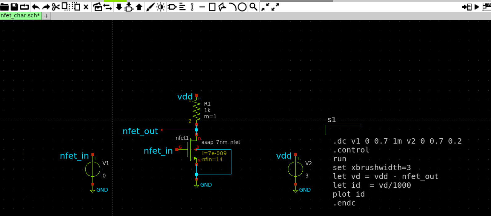
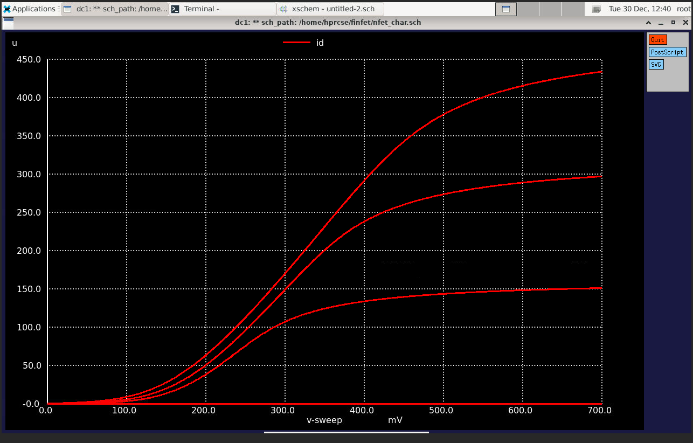
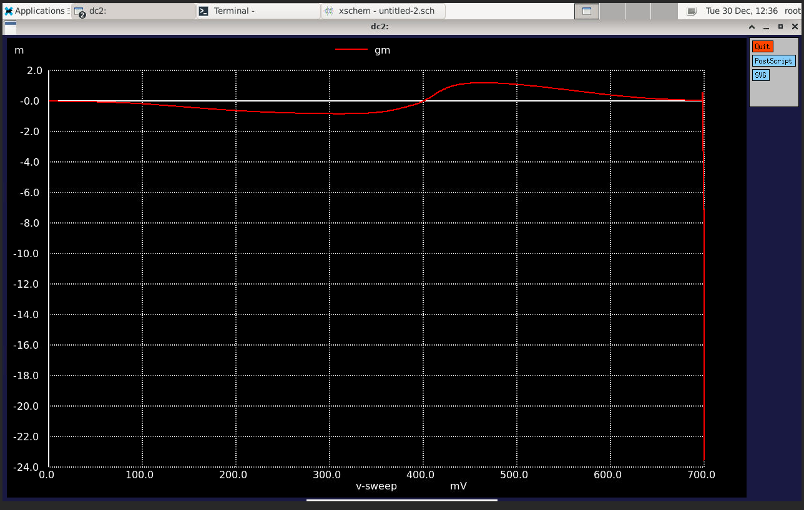
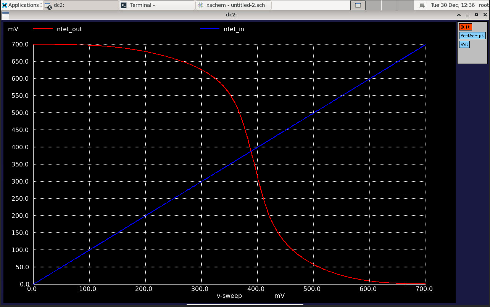
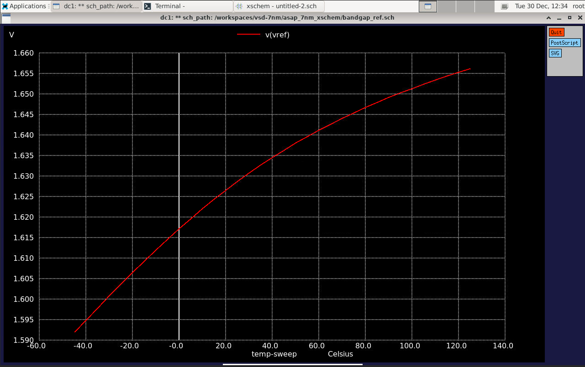
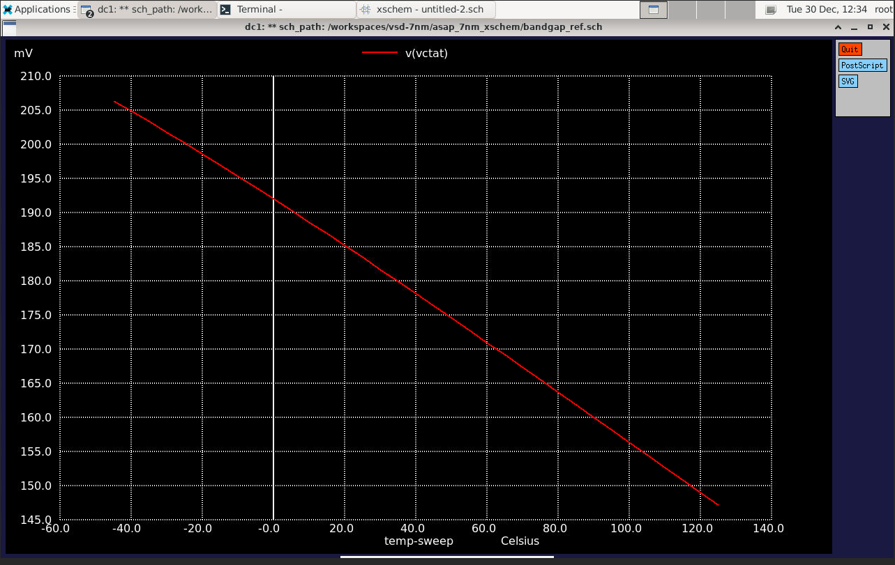

# FinFET 7nm Circuit Design & Characterization

This repository presents my work on designing, simulating, and characterizing FinFET-based analog and digital circuits at the advanced 7nm technology node. The project is completed as part of the VSD 7nm FinFET Workshop, utilizing the ASAP 7nm PDK and tools for schematic entry, simulation, and analysis.

---

## Table of Contents

- [Introduction](#introduction)
- [Characterization of CMOS VTC](#characterization-of-cmos-vtc)
- [CMOS Inverter_vtc Characteristics](#cmos-inverter_vtc-characteristics)
- [Design of BandGap Reference Circuit with Xschem](#design-of-bandgap-reference-circuit-with-xschem)
- [Results](#results)
- [Acknowledgements](#acknowledgements)
- [References](#references)

---

## Introduction

### What is FinFET?

A FinFET (Fin Field-Effect Transistor) is a type of non-planar, multi-gate transistor, widely adopted for sub-22nm CMOS technology due to its superior control over short-channel effects, reduced leakage, and enhanced performance. FinFET replaces the planar "MOSFET" channel with a thin, vertical fin, allowing the gate to wrap around the channel on three sides, resulting in improved electrostatic control and better device characteristics.

  
Comparison Table

| **Feature**           | **Planar MOSFET** | **FinFET (3D MOSFET)**        |
|-----------------------|-------------------|-------------------------------|
| Structure             | Flat channel      | Vertical fin-shaped channel   |
| Gate Control          | Gate on 1 side    | Gate on 3 sides               |
| Leakage Current       | High at <32nm     | Very low                      |
| Performance           | Limited scaling   | Higher speed, better Ion      |
| Power Consumption     | Higher            | Lower                         |
| Technology Node       | ≥45nm             | ≤22nm                         |
| SCE Resistance        | Poor              | Excellent                     |

FinFETs are now ubiquitous in 7nm technology and below, powering most modern SoCs, CPUs, GPUs, and RFICs.

---

## Theoretical Background: Device Physics, Circuits, and Analysis

Understanding the characteristics and performance of FinFET devices and their circuits is crucial as technology continues to scale below 22nm. Planar CMOS faces significant short-channel effects, leakage, and performance bottlenecks at these nodes. FinFETs are engineered to mitigate these problems with 3D channel geometry, increased gate control, and reduced variability. This not only allows for further scaling but also maintains robust digital and analog performance in advanced nodes like 7nm.

The following sections explore the theory and practical implications behind every simulation and measurement. Each dataset, plot, and table is accompanied by a concise explanation so that new learners and experienced engineers alike can appreciate both the *what* and the *why* of nanoscale transistor characterization and bandgap reference design.

---

## Characterization of CMOS VTC

### NFET Schematic

*NMOS device schematic created in Xschem for Id/Vd simulations:*

---
#### About NFET Id–Vd and Id–Vgs Curves

MOSFET drain current characteristics underpin all circuit design.  
- **Id vs. Vgs (Transfer):** Characterizes threshold voltage, subthreshold swing, and switching efficiency—key for low-voltage digital logic.  
- **Id vs. Vd (Output):** Reveals linear (triode) and saturation operating regions, core for analog gain/switch and digital speed, and exhibits short-channel effects more strongly in advanced FinFETs.

---

### NFET Id-Vd Characteristics

*Simulation setup and extracted transfer characteristics for NMOS:*

---

#### Understanding the CMOS Inverter and VTC

The CMOS inverter is a fundamental logic cell. Its voltage transfer characteristics (VTC) reveal critical qualities like:
- **Switching threshold (Vth):** Where Vin = Vout, influenced by the PMOS/NMOS strength ratio.
- **Noise margins:** The ranges of input voltage where output is guaranteed as '0' or '1', secured by the flatness/steepness of the VTC.

Key performance metrics, such as gain, delay, and current, are all derived from circuit simulation. Examining these over varying fin counts (modern analog to W/L ratio) gives insight into scalability, drive strength, and overall robustness.

---

## CMOS Inverter_vtc Characteristics

### Output Waveform (Inverter)

*Transient simulation showing inverter's output switching behavior:*

---

Drain current (Id) is the main indicator of how much charge the device can drive/sink, directly related to switching speed and logic strength. Higher Id generally means faster and stronger switching, but also more dynamic power use.

---

### Drain Current

*Shows inverter drain current characteristics during switching:*

---

Output resistance determines how much the output voltage will droop or rise as external load changes. Lower resistance is preferable for strong logic levels and high fan-out circuits.

---

### Output Resistance

*Calculated inverter output resistance:*

---

Transconductance reflects how effectively the input controls output current (gm = ΔId/ΔVgs). Higher gm generally means better gain and faster logic transitions.

---

### Transconductance

*Inverter transconductance result (gm versus input):*

---

### Inverter Schematic

*CMOS inverter schematic captured in Xschem:*

---

Switching threshold marks the precise point of state-flip for digital logic, where small input drifts could lead to output switching. Its value and sharpness govern sensitivity and immunity to disturbances.

### Switching Threshold Voltage

*Waveform used to determine the inverter’s V_th and noise margins:*

---

## Design of BandGap Reference Circuit with Xschem

---

## Bandgap Reference Design and Simulation – Theoretical Insights

A bandgap reference circuit produces a voltage that remains steady across supply and temperature variations.  
**Bandgap references** are building blocks for analog, power management, and precision digital domains (LDOs, ADC/DACs, PLLs). At deep submicron/FinFET nodes, true BJTs used classically are typically emulated by MOS configurations or modified circuit strategies, still relying on the addition of a “PTAT” (proportional to abs. temperature) and a “CTAT” (complementary to abs. temperature) voltage. Their careful balancing cancels out temperature variations and allows the reference voltage (Vref) to remain flat over process and environment change.

- **PTAT and CTAT sources**: Provide voltages that rise or fall linearly with temperature, synthesized in these circuits by specially composed transistor/resistor arrangements.
- **Self-Biased Current Mirror (SBCM):** Ensures reliable operation regardless of process or supply swings.

### BandGap Reference (Architecture Reference)

*Reference block diagram for bandgap circuit using SBCM:*

---

### Xschem Bandgap Schematic

*Bandgap reference full schematic as drawn in Xschem:*

---

### Vref vs Temperature

*Simulation showing reference voltage stability across temperature sweep:*

---

PTAT (Proportional to Absolute Temperature) and CTAT (Complementary to Absolute Temperature) voltages provide insight into the underlying temperature dependencies used in the bandgap reference circuit. Each must be carefully sized and summed for overall compensation.

### PTAT/CTAT Voltages

*Simulated PTAT/CTAT voltage behavior in the bandgap circuit:*

---

**Table Interpretation:**  
These tables compile the performance extracted from simulation, highlighting how device geometry (number of fins for NMOS/PMOS) and circuit topology affect current, gain, speed, noise margins, and reference voltage flatness. High speed, robust noise margins, and small change in Vref with temperature/supply are key hallmarks of well-designed nanometer circuits.

## Results

All simulation results, schematics, and plots are located in:

- [`/Images`](./Images) — Circuit diagrams and waveforms
- [`/results`](./results) — Measurement tables and plots
- [`/spice_code`](./spice_code) — SPICE simulation files

### Bandgap Reference Characterization Table

| S.No | VDD (V) | Temp (°C) | Vref (V) | Line Reg. (mV/V) | Startup Time (ns) |
|------|---------|-----------|----------|------------------|-------------------|
| 1    | 0.80    | 27        | 0.6760   | 845.0            | 3.48              |
| 2    | 0.90    | 27        | 0.7770   | 863.3            | 4.2               |
| 3    | 1.00    | 27        | 0.8779   | 877.9            | 4.5               |
| 4    | 1.00    | -40       | 0.8281   | 828.0            | 66.89             |
| 5    | 1.00    | 125       | 0.9220   | 922.0            | 1.03              |

# Inverter Characterization Results (7nm FinFET)

| Test # | nfin_p | nfin_n | Id (A)     | Power (W) | tpd (ps) | Gain  | NML (V) | NMH (V)  | gm (S)    | f (Hz)    |
|-------:|-------:|-------:|:----------:|----------:|---------:|------:|--------:|---------:|----------:|----------:|
| 1      | 4      | 4      | -6.33E-05  | 8.50E-06  | 25.30    | 6.43  | 0.0444  | -0.0320  | 3.53E-04  | 2.25E+10  |
| 2      | 9      | 9      | -1.42E-04  | 1.91E-05  | 25.30    | 6.43  | 0.0444  | -0.0320  | 7.94E-04  | 2.25E+10  |
| 3      | 14     | 14     | -2.22E-04  | 2.97E-05  | 25.30    | 6.43  | 0.0444  | -0.0320  | 1.24E-03  | 2.25E+10  |
| 4      | 17     | 17     | -2.69E-04  | 3.61E-05  | 25.30    | 6.43  | 0.0444  | -0.0320  | 1.50E-03  | 2.25E+10  |
| 5      | 4      | 9      | -8.42E-05  | 1.23E-05  | 24.85    | 6.70  | 0.0265  | -0.0138  | 4.29E-04  | 2.27E+10  |
| 6      | 9      | 14     | -1.78E-04  | 2.37E-05  | 25.02    | 6.52  | 0.0346  | -0.0127  | 8.95E-04  | 2.26E+10  |
| 7      | 14     | 17     | -2.50E-04  | 3.28E-05  | 25.16    | 6.45  | 0.0404  | -0.0124  | 1.31E-03  | 2.25E+10  |
| 8      | 17     | 4      | -7.40E-05  | 1.52E-05  | 26.22    | 6.87  | 0.0611  | -0.0267  | 7.99E-04  | 2.16E+10  |
| 9      | 4      | 14     | -8.70E-05  | 1.45E-05  | 24.63    | 7.04  | 0.0175  | -0.0040  | 4.59E-04  | 2.28E+10  |
| 10     | 9      | 17     | -1.85E-04  | 2.58E-05  | 24.93    | 6.60  | 0.0307  | -0.0120  | 9.34E-04  | 2.27E+10  |
| 11     | 14     | 4      | -7.36E-05  | 1.42E-05  | 26.08    | 6.78  | 0.0613  | -0.0184  | 7.32E-04  | 2.16E+10  |
| 12     | 17     | 9      | -1.60E-04  | 2.53E-05  | 25.68    | 6.53  | 0.0556  | -0.0422  | 1.19E-03  | 2.20E+10  |

---

## Acknowledgements

Special thanks to:

- [Kunal Ghosh](https://github.com/kunalg123) (VSD Co-Founder)
- [Soundarya Madhuri Royyuru](https://github.com/RSMadhuri66/Bandgap-Reference-Circuit-with-SCMB-with-ASAP-7nm-PDK-)
- Instructors & community mentors from VSDIAT.

---

## References

- [Bandgap Circuit VSDIAT](https://github.com/vsdip/vsdopen2021_bgr/tree/main)
- [ASAP 7nm Xschem Reference](https://github.com/AsahiroKenpachi/asap_7nm_Xschem)
- [FinFET Theory - IIT Labs](https://vlsi-iitg.vlabs.ac.in/CMOS_theory.html)
- [NGSPICE Tutorial](https://ngspice.sourceforge.io/docs/ngspice-manual.pdf)
- Further reading in design and characterization papers linked in reference repos.

---

_If you use this repository, please star/fork and acknowledge accordingly!_
